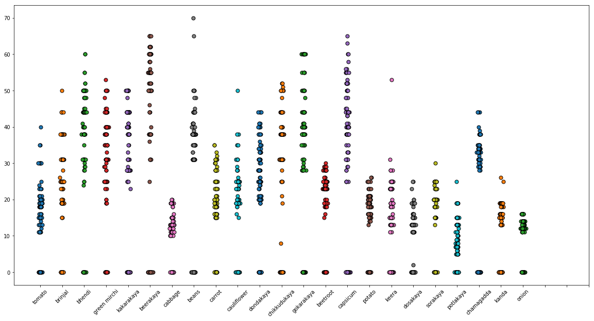
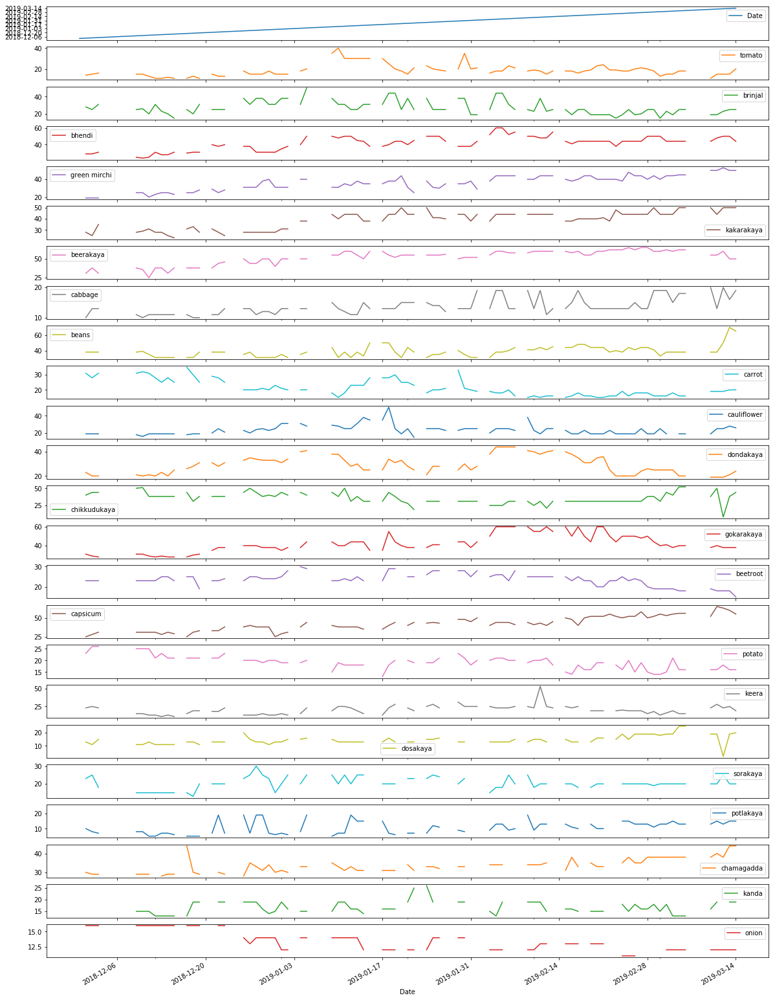

# Vegetable-Prices

Sourced from [Eenadu newspaper](http://epaper.eenadu.net/)

## Process

Everyday, values are manually entered from the district edition.

Data available from 1st Dec 2018 until 20th March 2019

### Distribution of prices

Instances where vegetable prices aren't available (sporadic reporting) are replaced with zeros

### Trend

| Name | Other names |
| ---- | ------------------ |
| bhendi | Okra |
| kakarakaya | Bitter gourd, Karela |
| beerakaya | Ridge gourd, |
| dondakaya | Ivy gourd, Tindora |
| chikkudukaya | Broad beans |
| gokarakaya | Cluster beans |
| keera | Cucumber |
| dosakaya | Yellow cucumber |
| sorakaya | Bottle gourd |
| potlakaya | Snake gourd |
| chamagadda | Yam |
| kanda | Yam, Elephant foot yam |

## TODO

- Scrape from Eenadu online newspaper
- Extend for other districts and zones
